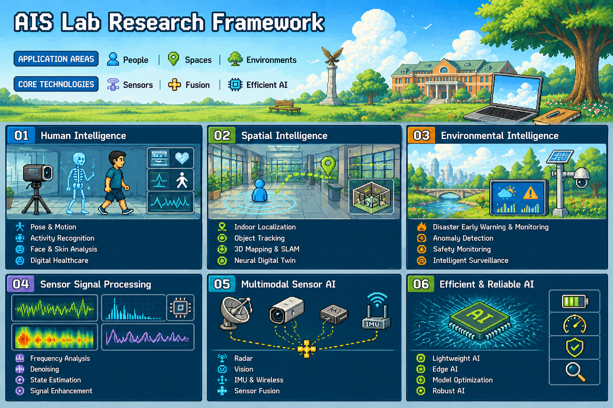

<p align="center">
  
</p>


# AIS Lab
## AI & Intelligent Sensing Laboratory

> AI-driven Sensor Signal Processing for Understanding People, Spaces, and Environments.

AIS Lab develops AI-driven sensor signal processing methods for radar, vision, IMU, wireless, and IoT sensing systems.
Our research combines artificial intelligence, signal processing, multimodal sensor fusion, and efficient AI technologies to build intelligent sensing systems for real-world applications.

---

# Research Framework

```
                                     AI for Intelligent Sensing
                                                   │
        ┌────────────────┬────────────────┬────────────────┬────────────────┬────────────────┐
        │                │                │                │                │                │
     Human           Spatial       Environmental      Sensor Signal     Multimodal      Efficient &
  Intelligence     Intelligence     Intelligence       Processing        Sensor AI      Reliable AI


AI & Intelligent Sensing Laboratory
│
└── AI for Intelligent Sensing
    ├── Human Intelligence
    ├── Spatial Intelligence
    ├── Environmental Intelligence
    ├── Sensor Signal Processing
    ├── Multimodal Sensor AI
    └── Efficient & Reliable AI

```

---

## 01. Human Intelligence

Understanding people through intelligent sensing.

```
Human Intelligence
│
├── Pose & Motion
│   ├── Human Pose Estimation
│   ├── Motion Analysis
│   ├── Gait Analysis
│   └── Motion Understanding
│
├── Activity Recognition
│   ├── Human Activity Recognition
│   ├── Behavior Understanding
│   └── Abnormal Activity Detection
│
├── Face & Body Analysis
│   ├── Face Analysis
│   ├── Skin Analysis
│   ├── Physiological Signal Analysis
│   └── Fatigue Estimation
│
└── Digital Healthcare
    ├── Contactless Monitoring
    ├── Health Assessment
    └── AI-based Healthcare
```

---

## 02. Spatial Intelligence

Understanding spaces through localization and digital environments.

```
Spatial Intelligence
│
├── Indoor Localization
│   ├── Wi-Fi Localization
│   ├── Vision-based Localization
│   ├── IMU Navigation
│   └── Sensor Fusion Localization
│
├── Object Tracking
│   ├── Human Tracking
│   ├── Vehicle Tracking
│   ├── Drone Tracking
│   └── Trajectory Prediction
│
├── 3D Mapping
│   ├── 3D Reconstruction
│   ├── SLAM
│   ├── Scene Understanding
│   └── Spatial Modeling
│
└── Neural Digital Twin
    ├── Gaussian Splatting
    ├── Digital Twin
    └── Spatial AI
```

---

## 03. Environmental Intelligence

AI for safer and smarter environments.

```
Environmental Intelligence
│
├── Disaster Early Warning & Monitoring
│   ├── Environmental Monitoring
│   ├── Early Warning Systems
│   └── Intelligent Alert Systems
│
├── Anomaly Detection
│   ├── Scene Anomaly Detection
│   ├── Sensor Anomaly Detection
│   └── Environmental Change Detection
│
├── Safety Monitoring
│   ├── Human Safety
│   ├── Risk Assessment
│   └── Accident Prevention
│
└── Intelligent Surveillance
    ├── CCTV Analytics
    ├── Drone Monitoring
    ├── IoT Monitoring
    └── Smart Surveillance
```

---

## 04. Sensor Signal Processing

Core technologies for intelligent sensing.

```
Sensor Signal Processing
│
├── Signal Representation
│   ├── Time Domain
│   ├── Frequency Domain
│   ├── Time-Frequency Domain
│   └── Multidomain Analysis
│
├── Signal Enhancement
│   ├── Noise Suppression
│   ├── Signal Restoration
│   ├── Adaptive Processing
│   └── Quality Enhancement
│
├── State Estimation
│   ├── Filtering
│   ├── Prediction
│   ├── Tracking
│   └── Uncertainty Modeling
│
└── Feature Transformation
    ├── Dimensionality Reduction
    ├── Feature Extraction
    ├── Representation Learning
    └── Latent Space Modeling
```

---

## 05. Multimodal Sensor AI

Learning from heterogeneous sensing modalities.

```
Multimodal Sensor AI
│
├── Radar
├── Vision
├── IMU
├── Wireless Sensing
├── IoT Sensors
│
└── Sensor Fusion
    ├── Data-level Fusion
    ├── Feature-level Fusion
    ├── Decision-level Fusion
    └── Uncertainty-aware Fusion
```

---

## 06. Efficient & Reliable AI

Building practical AI systems for real-world deployment.

```
Efficient & Reliable AI
│
├── Lightweight AI
│   ├── Model Compression
│   ├── Knowledge Distillation
│   ├── Quantization
│   └── Pruning
│
├── Edge AI
│   ├── Embedded AI
│   ├── Mobile AI
│   ├── Real-time Inference
│   └── Low-power AI
│
├── Model Optimization
│   ├── Memory Optimization
│   ├── Efficient Inference
│   ├── Sustainable AI
│   └── Resource-aware Computing
│
└── Robust AI
    ├── Generalization
    ├── Explainable AI
    ├── Reliability
    └── Uncertainty Estimation
```

---

# Research Vision

AIS Lab aims to develop intelligent sensing technologies that enable machines to understand **people**, **spaces**, and **environments** by combining artificial intelligence with advanced sensor signal processing.

Our long-term vision is to bridge AI algorithms and real-world sensing systems for healthcare, robotics, autonomous systems, digital twins, and future intelligent environments.
